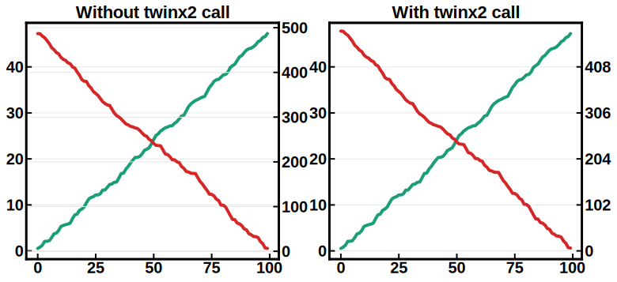

# LovelyPlots
<!-- []()  -->

LovelyPlots is a repository containing ``matplotlib`` style sheets to nicely format figures for scientific papers, thesis and presentations while keeping them fully editable in ``Adobe Illustrator``. Additonaly, ``.svg`` exports options allows figures to automatically adapt their font to your document's font. For example, ``.svg`` figures imported in a ``.tex`` file will automatically be generated with the text font used in your ``.tex`` file.

<p align="center" width="50%">
    
</p>

# Installation

```bash
# to install latest PyPI release (will not include everything)
pip install LovelyPlots
# or if that does not work, which it typically does not for me if I am working in a conda environment:
python3 -m pip install LovelyPlots

# to install latest GitHub commit (recommended)
pip install git+https://github.com/johnryt/LovelyPlots
# or if that does not work, which it typically does not for me if I am working in a conda environment:
python3 -m pip install git+https://github.com/johnryt/LovelyPlots

```

The pip installation will move all of the ``matplotlib`` style files ``*.mplstyle`` into the appropriate ``matplotlib`` directory.

# Usage

You can use the styles it adds (described farther below), but also can import the many functions from the useful_functions module using
```python
from LovelyPlots.useful_packages import *
```
The packages included in useful_packages are:
- init_plot(): allows fine-tuning of matplotlib styles such that you can easily change nearly any aspect on the fly (e.g. default fontsize, color cycler).
- easy_subplots(): sets up plt.subplots with the correct number of rows and columns and figsize, given number of plots (nplots) and the number of columns (ncol), or just a list that you want to iterate (can then plot the things in the list in a for loop with "for i,a in zip(list, ax)" and it will try to optimize to give either 3 or 4 columns based on lenth of list (or nplots). Option to make figures taller/shorter or wider/narrower by changing height_scale or width_scale. Can also change relative widths/heights of subplots.
- twinx2(): If you have a twinned y-axis on both sides of a plot, this function will set the y-ticks of the twinned axis to be at the same location as the y-ticks of the original axis, with n controlling the number of decimal points displayed. See an example below.
- do_a_regress(): automatically runs a linear regression and plots the results. Can be configued to plot the x vs y data if the regression is in y=mx+b form, or to give predicted vs actual.
- add_labels(): Add labels to scatter plot for each common index in series x and y, given matplotlib axis object.
- kstest100(): Takes in series, creates 100 simulated normal distributions from the series mean, std, and length, and returns the mean coefficient and p-value of the Kolmogorov-Smirnov test of the series x and its simulated counterpart.
- add_regression_text(): adds the regression line equation to a plot of y vs x for model m, showing the equation of the line and R2 goodness of fit. Used within the do_a_regress() function if you don't want to mess with it. 
- find_best_dist(): takes a stacked dataframe and outputs a list of distributions that best fits that data (Weibull, normal, lognormal, beta, etc.). By default plots the actual and generated data histograms.
- year_decimal_to_datetime(): Takes in any year-as-decimal value and returns the equivalent (to microsecond) datetime form. Useful for converting something like daily data pulled from a figure using something like webplot digitizer.
- pval_to_star(): Converts a value from its numerical value to a string where: *** < 0.001 < ** < 0.01 < * < 0.05 < . < 0.1

LovelyPlots main style is called ``ipynb``. To use it, add the following lines to the begining of your python scripts:

```python
import matplotlib.pyplot as plt
plt.style.use('ipynb')
```

Styles can be combined:

```python
import matplotlib.pyplot as plt
plt.style.use(['ipynb','colorsblind34'])
```

In the above case, the ``ipynb`` default color cycle will be overwritten by a 34 colors colorblind safe color cycle called ``colorsblind34``.

If you only wish to apply a style on a specific plot, this can be achieved using:

```python
import matplotlib.pyplot as plt

with plt.style.context('ipynb'):
  fig, ax = plt.subplots()
  ax.plot(x, y)
```

# Examples

Here is what the twinx2 function does (may require some fiddling with the ylim on the twinned y-axis to get nice-looking values).



When changing local defaults using the init_plot function, can use any of the built-in matplotlib cmaps, as well as any list/array of colors you like, or any of the three strings I've added: john-map, john-defense, john-defense-dark:

'john-map'

'john-defense'

'john-defense-dark'

A few styles are presented here, please see [Styles](#Styles) for a list of all implemented styles. The script used to generate these plots can be found [here](examples/plot.py).

:warning: If you use the ``use_mathtext`` style, ``Adobe Illustrator`` might fail to nicely detect text objects. Please see [here](#Tips-and-Tricks) for work arounds.


The ``['ipynb', 'use_mathtext']`` style:


The ``['ipynb', 'use_mathtext','colors10-markers']`` style:


The ``['ipynb', 'use_mathtext','colors5-light']`` style:


The ``['ipynb', 'use_mathtext', 'colors10-ls']`` style:


The ``['ipynb']`` style:


# Styles

LovelyPlots main style is called ``ipynb``. The latter by default sets the figure size to ``(4.5, 3.46) inches``, uses the default ``matplotlib`` font, activate scientific notation and makes sure your ``matplotlib`` exports will be editable in ``Adobe Illustrator``. Its default color cycle was set to ``colors10``.

## Color cycles

A multitude of color cycles were implemented:

``colors5-light``


``colors5``


``colors10``


``colorsblind10``


``colorsblind34``

Can be seen [here](figs/colors/colorsblind34.png).


## Lines styles, markers and combinations styles

Line styles, markers styles and combinations can be set using the following styles: `ls5`, `marker7`, `colors10-ls`, `colors10-markers`.

## Color maps
Default ``matplotlib`` colormaps were implemented and can be used by adding the following styles: ``cmap-viridis``, ``cmap-inferno``, ``cmap-cividis``, ``cmap-magma``, ``cmap-plasma``.

## Utils

Specific ``matplotlibrc`` parameters can be turned ``on/off`` using the following utilities styles: ``svg_no_fonttype``, ``use_mathtex``, ``use_tex``.

## Fonts

By default the ``ipynb`` style uses the default ``matplotlib`` font. However, one can set its favorite font from a TIFF file:

```python
import matplotlib.pyplot as plt
import LovelyPlots.utils as lp

plt.style.use('ipynb')
lp.set_font('my_font.tiff')
```


# Tips and Tricks

## Adobe Illustrator

Unfortunately, ``mathtext`` (and thus nicely formated scientific notation) will mess up ``Adobe illustrator`` ability to detect text objects, and is thus not activated by default. If you wish to use it, please add the style ``use_mathtext``.

## Latex and SVG files
By default, the ``ipynb`` style sets ``svg.fonttype: none``. This allows for plots saved as ``.svg`` not to carry font information. Consequently, when opened in another environement, the plot will be generated with the default system font.

For example, this allows ``.svg`` plots imported inside a ``Latex`` file to directly be generated with the proper document font, without you having to manually edit the fonts to match your document's font. Additonally, you can open the ``.svg`` file as  text file, find the ugly ``1e10`` scientific notation and replace it with ``$10^10$`` so that it is nicely formated when included in your ``.tex`` file.

An example of how to show an svg in a ``.tex`` file:

```tex
\usepackage{svg}

\begin{figure}[htbp]
  \centering
  \includesvg{myfig.svg}
\end{figure}
```
## Retina displays

For those using ``IPython`` notebooks, you can set retina display support by adding the following lines to the begining on your python script:


```python
import LovelyPlots.utils as lp
lp.set_retina()
```
## Useth in Google Colab
To use on Google Colab, you will need to run the following code:
```python
!pip install LovelyPlots
plt.style.reload_library()
plt.style.use('ipynb')
```

# Acknowledgements

This reprository was inspired by [SciencePlots](https://github.com/garrettj403/SciencePlots), but adds different styles and crucial functionalities for useth in ``.tex`` files and ``Adobe Illustrator``.


# Citing 

Citing LovelyPlots is not necessary, but it is always nice and appreciated if you do: 


    @article{LovelyPlots,
      author       = {Killian Sheriff},
      title        = {{killiansheriff/LovelyPlots}},
      month        = jul,
      year         = 2022,
      publisher    = {Zenodo},
      version      = {0.0.24},
      doi          = {10.5281/zenodo.6903937},
      url          = {http://doi.org/10.5281/zenodo.6903937}
    }
